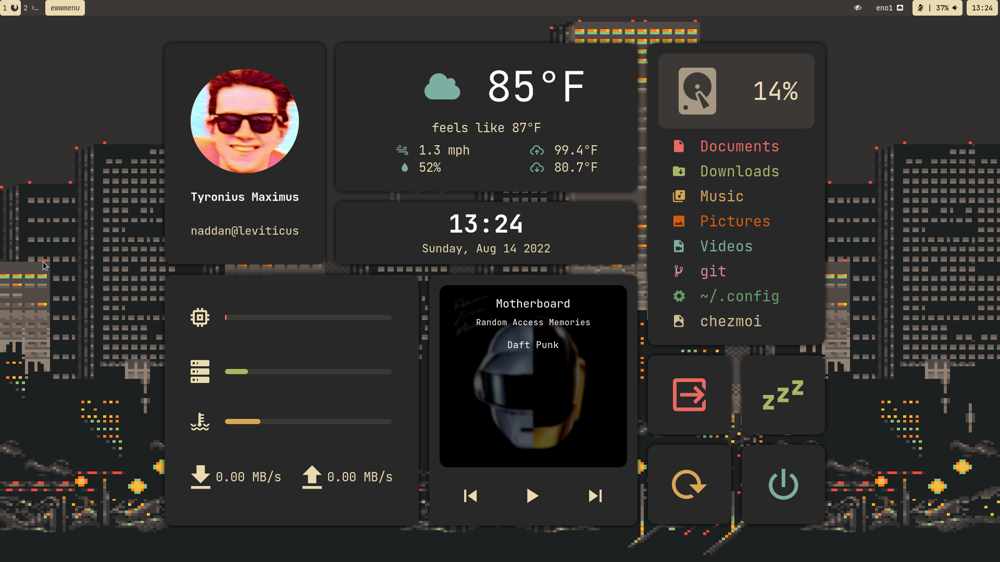

# Tyrumus's Dotfiles

If you came from [this Reddit post,](https://www.reddit.com/r/unixporn/comments/6drt6c/awesomewm_noobs_paradise/) you're probably looking for [this repo instead.](https://github.com/tyrumus/dotfiles-old)

This new repo is managed by [chezmoi](https://www.chezmoi.io/)

## System Information

Some details about the current setup, and links to their respective install/config information (Arch Wiki preferred).

- Distro: [Arch Linux](https://archlinux.org/)
- Window Manager: [Sway](https://wiki.archlinux.org/title/Sway)
- Shell: [Zsh](https://wiki.archlinux.org/title/Zsh)
- Terminal Emulator: [Kitty](https://wiki.archlinux.org/title/Kitty)
- Display Manager: [greetd](https://wiki.archlinux.org/title/Greetd) with greeter [greetd-tuigreet](https://wiki.archlinux.org/title/Greetd#tuigreet)
- App Launcher: [rofi](https://wiki.archlinux.org/title/Rofi)
- Widgets: [eww](https://github.com/elkowar/eww)
- Panel: [waybar](https://github.com/Alexays/Waybar)
- Text Editor: [Neovim](https://wiki.archlinux.org/title/Neovim)
- File Manager: [ranger](https://wiki.archlinux.org/title/Ranger)
- Notification Daemon: [dunst](https://wiki.archlinux.org/title/Dunst)
- Music Player: [spotifyd](https://spotifyd.github.io/spotifyd/)
- Lockscreen: [swaylock-effects](https://github.com/jirutka/swaylock-effects)
- Color scheme: [gruvbox](https://github.com/morhetz/gruvbox)

## Screenshot



## Setup
Install chezmoi with your distro's package manager, then run the following:
```
$ chezmoi init https://github.com/tyrumus/dotfiles.git
```

My `run_once` scripts are intended to deploy [an entirely new Arch Linux install.](https://github.com/tyrumus/dotfiles#run-unattended-arch-linux-install) **This will install tons of packages and enable systemd services.**

If you don't want my automated scripts to mess up your Linux install, run the following command:
```
$ chezmoi cd
$ sh install/disable-install.sh
$ exit
```

Finally, apply the dotfiles:
```
$ chezmoi apply
```

Logout of your session, and log back in. Enjoy!

## Run unattended Arch Linux install

[Follow the Arch Linux install guide](https://wiki.archlinux.org/title/Installation_guide) to do the following:
1) Partition the target drive
2) Connect to the Internet

Here's the GPT layout the install script expects:
Partition | if drive is `/dev/sda` | Partition Type
--- | --- | ---
`/dev/efi_system_partition` | `/dev/sda1` | ESP
`/dev/swap_partition` | `/dev/sda2` | Linux swap
`/dev/root_partition` | `/dev/sda3` | Linux x86-84 root (/)

### Running the Install Script

Once that's done, download the install script:
```
$ curl -L https://git.io/JyoUF -o install.zsh
```

Edit the variables at the top of the downloaded script, and execute it.

What are each of the variables for?
Name | Description | Example
--- | --- | ---
DRIVE | Name of target install disk | `/dev/sda`
USRNAME | Username of sudoer account | `urmum`
HOSTNAME | Hostname of the system | `smokedcheese`
TIMEZONE | Desired timezone system time should be displayed | `Europe/Zurich`
PACKAGES | List of packages installed every time, separated by spaces | `base linux linux-firmware`
LAPTOP_PACKAGES | List of packages installed when system is a laptop | `iwd`
NVIDIA_PACKAGES | List of packages installed when system has NVIDIA graphics card | `nvidia-lts`
CHEZMOI_URL | URL of dotfiles repository to install upon next user login | `https://github.com/you/your-dotfiles.git`

## TODO

- Make `install/arch-install.zsh` automatically set up partitioning
